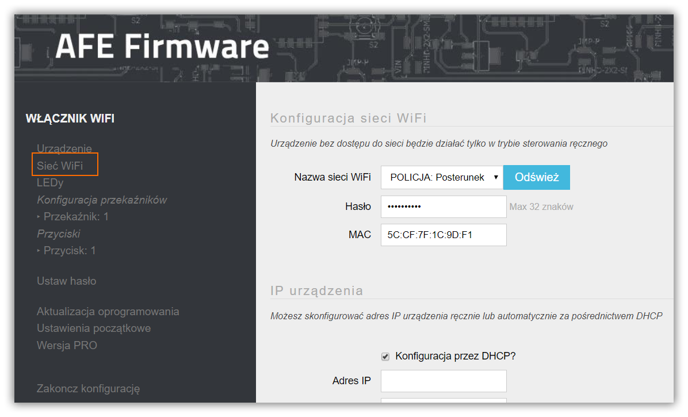
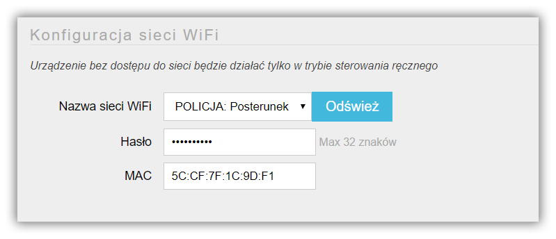
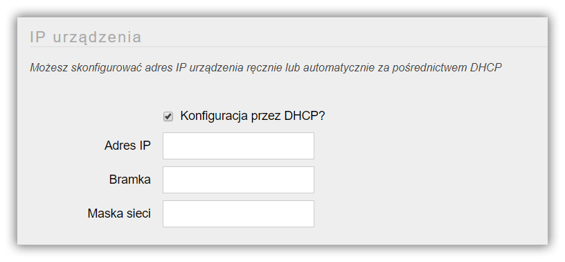

Aby w pełni wykorzystać możliwości urządzenia, musi ono być podłączone do sieci WiFi. Nie ma konieczności, aby urządzenie z AFE Firmware musiało mieć dostęp do sieci Internet.

> Przy braku połączenia urządzenia z siecią WiFi, urządzenie działa w trybie ręcznym, tzn. jeśli urządzenie posiada przekaźnik oraz przycisk to przyciskiem można włączać / wyłączać przekaźnik.

Forumularz konfiguracji WiFi umożliwia

* ustawienie parametrów sieci WiFi, z która urządzenie będzie podłączone
* przydzielenie stałego adresu IP lub dynamicznie przyznawanego przez Serwer DHCP router'a WiFi
* ustawienie parametrów związanych z łączeniem się z routerem WiFi

---


**Spis treści**

    
    
    {{ table_of_contents }}
    



---

Ekran do konfiguracji WiFi uruchamia się zaznaczając element Sieć WiFi w menu Panelu Konfiguracyjnego AFE Firmware.

#### Sekcja: Konfiguracja sieci WiFi

##### Nazwa sieci WiFi

* Sieci WiFi dostępne są do wybrania z listy rozwijalnej
* Jeśli na liście brak jest sieci WiFi, z którą urządznie powinno się łączyć, należy wcisnąć przycisk **Odśwież**. Lista rozwijalna zostanie odświeżona z dostępnymi sieciami WiFi

!!! W przypadku braku na liście nazwy sieci WiFi spróbuj umieścić urządzenie bliżej routera WiFi. ESP8266/8285 nie obsługuje sieci w 5GHz, Upewij się, że sieć, z którą chcesz połączyć urządzenie działa w 2.4GH

##### Hasło

* Hasło sieci WiFi

##### MAC

* Adres MAC urządzenia
* Informacja tylko do odczytu

!!! Adres MAC może być przydatny do wyszukania adresu IP urządzenia w panelu konfiguracyjnym routera WiFi

#### Sekcja: Nadawania adresu IP urządzeniu

##### Automatyczna konfiguracja przez DHCP

* Jeśli parametr jest zaznaczony, urządzeniu zostanie nadany automatycznie adres IP przez Serwer DHCP routera WiFi
* Jeśli parametr nie jest zaznaczony, należy wprowadzić adres IP, bramkę oraz maskę sieci

!!!! Adres IP, Bramka i Maska sieci nie jest wymagana przy zaznaczonym **Automatyczna konfiuracja przez DHCP**

##### Adres IP

* Adres IP urządzenia

!! Pamiętaj, że adres IP urządzenia musi być unikalny w ramach lokalnej sieci WiFi

##### Bramka

* Adres IP bramy. Na ogół będzie to adres IP routera WiFi

##### Maska sieci

* Maska sieci. Na ogół będzie to: 255.255.255.0

#### Sekcja: Zaawansowane parametery dot. łączenia się z routerem WiFi

Tutaj konfigurowane są parametry nawiązywania połączenia urządzenia z routerem WiFi. Jeśli nie masz specyficznych powodów, pozostaw wartości domyślne dla tych parametrów.

#### Ilość  prób łączenia się

* Liczba prób nawiązywania połączenia z routerem WiFi zanim urządzenie przestanie nawiązywać połączenie i przejdzie w tryb uśpienia
* Zakres: od 1 do 255
* Informacja wymagana

#### Czas między próbami łączenia się

* Parametr określa czas oczekiwania między kolejnymi próbami nawiązywania połączenia z routerem WiFi
* Zakres od: 1 do 255 sekund
* Informacja wymagana

#### Czas po jakim powtórzyć próby łączenia się

* Czas uśpienia urządzenia po X nieudanych próbach łączenia się z routerem WiFi, X – to liczba zdefiniowana przez parametr: **Ilość prób łączenia się**
* Po tym czasie urządzenie ponowie będzie próbowało połączyć się z routerem WiFi
* Zakres: 1 do 255 sekund
* Informacja wymagana