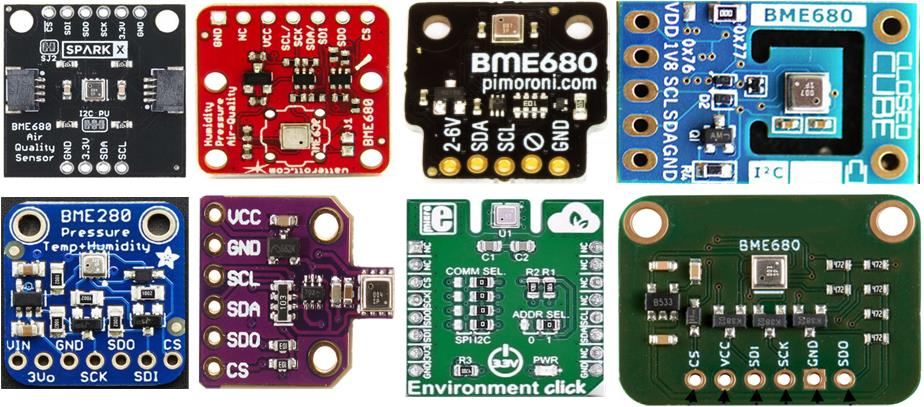
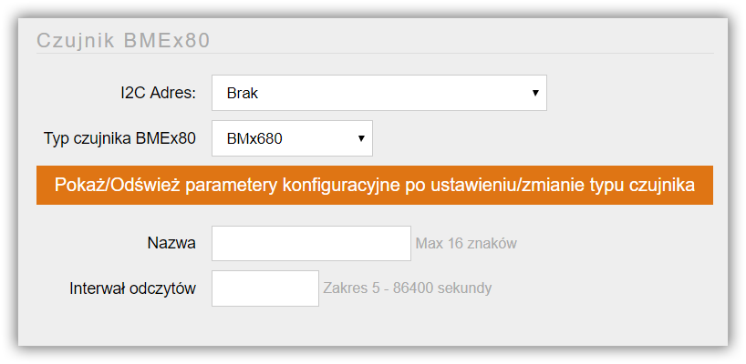
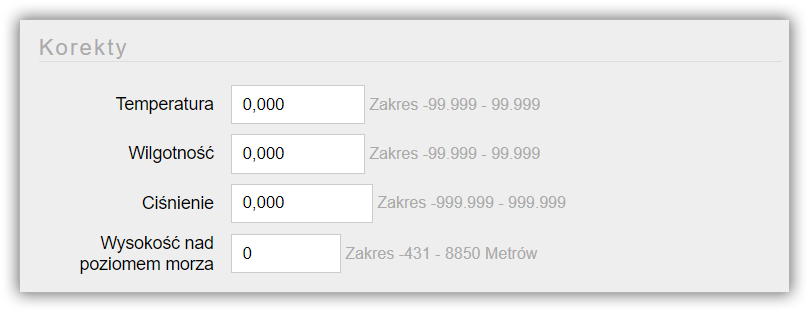
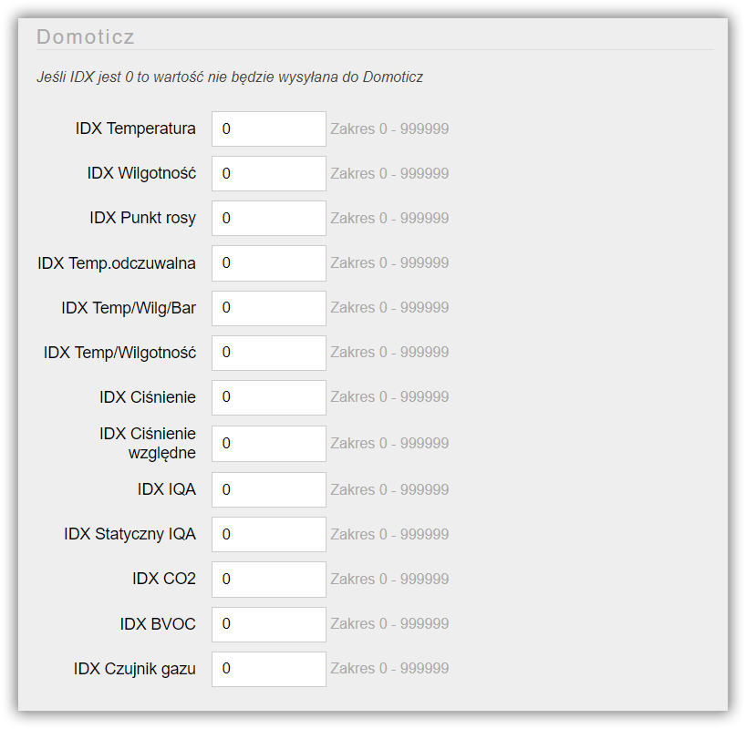

**BME680** to zintegrowany czujnik gazu, ciśnienia, temperatury i wilgotności. Dodatkowo czujnik gazu w BME680 może wykrywać szeroki zakres gazów do pomiaru jakości powietrza. Gazy, które mogą być wykrywane przez BME680, obejmują lotne związki organiczne (VOC) z farb (takich jak formaldehyd), lakiery, produkty do usuwania farby, środki czyszczące, meble, sprzęt biurowy, kleje, kleje i alkohol

##### Specyfikacja
* Zakres pomiaru temperatury: -40~85 ℃
* Dokładność pomiaru temperatury: ±1 ℃
* Zakres pomiaru wilgotności powietrza: 0-100 %
* Dokładność pomiaru wilgotności powietrza: ±3 %
* Zakres pomiaru ciśnienia: 300-1100 hPa
* Dokładność pomiaru ciśnienia atmosferycznego: ±0,6 hPa
* Zakres pomiaru jakości powietrza: 0-500
* Interfejs: I²C, SPI
* Pobór prądu: 3,7 uA (max)
* Napięcie zasilania: 1,7-3,6 V
* [Specyfikacja BME680](BST-BME680-AN008-45x.pdf)

**BME280** to czujnik warunków atmosferycznych: ciśnienia, wilgotności, temperatury

##### Specyfikacja
* Pobór prądu: średnio 3,6 μA 
* Zakres pomiaru ciśnienia: 300-1100 hPa
* Zakres pomiaru temperatury: -40-85°C
* Zakres pomiaru wilgotności: 0-100%
* Napięcie zasilania: 1,71-3,6 V
* [Specyfikacja BME280](BST-BME280_DS001-11.pdf)

Czujnik **BMP180/085** to cyfrowym barometr z wbudowanym termometrem

##### Specyfikacja
* Napięcie zasilania: 1,8 V - 3,6 V
* Zakres pomiaru ciśnienia: 300 - 1100 hPa
* Dokładność: 0,02 hPa (w trybie zaawansowanym)
* Interfejs komunikacyjny: I²C (TWI)
* Wbudowany termometr
* [Specyfikacja BMP180](bmp180_datasheet.pdf)

---

!! AFE Firmware wymaga, aby czujnik podłączony został do magistrali [I²C](/konfiguracja/konfiguracja-urzadzenia/konfiguracja-portow/i2c/?target=_blank)

---

Ekran do konfiguracji czujnka Bosch z serii BMx80 otwiera się wybierając opcję CzujnikBMEx80 -> Czujnik w menu Panelu Konfiguracyjnego AFE Firmware.

#### Sekcja Czujnik BMEx80

##### I²C Adres
* Adres czujnika w magistrali I²C

> Jeśli adres czujnika nie jest widoczny w liście sprawdź podłączenie czujnika lub konfigurację [I²C](/konfiguracja/konfiguracja-urzadzenia/konfiguracja-portow/i2c/?target=_blank)

##### Typ czujnika BMEx80
* Lista obsługiwanych czujników Bosch

> Po wybraniu typu czujnka konieczne jest wciśnięcie przycisku: _**Pokaż parametery konfiguracyjne po wybraniu typu czujnia**_ Po wciśnięciu przycisku na ekranie konfiguracyjnym wyświetlą się specyficzne parametery konfiguracyjne dla wybranego typu czujnika Bosch

##### Nazwa
* Nazwa czujnika
* Nazwa wykorzystywana jest do odczytu wartości z czujnika za pomocą HTTP
* Maksymalna długość nazwy to do 16 znaków
* Nie należy używać znaków spacji

##### Interwał odczytów
* Częstotliwość odczytów oraz przesyłania daych do systemu automatyki
* Wartość z zakresu od 5 sekundy do 24 godzin. Wartość wprowadza się w sekundach

#### Sekcja jednostki

##### Temperatura
* Wybór jednostki, w której mają być wyświetlane wartości związane z temperaturą: np. temperatura, Punkt rosy, Head Index
* C - Celsjusz, F - Fahrenheit

#### Sekcja Korekty

W tym miejscu można dokonać kalibracji wartości czujnika dla poszczególnych pomiarów

##### Temperatura
* Wartość korekty temperatury odczytanej przez czujnik
* Wartośc minimalna to -99.999 wartośc maksymalna korekty to 99.999

##### Wilgotność
* Wartość korekty wilgotności odczytanej przez czujnik
* Wartośc minimalna to -99.999 wartośc maksymalna korekty to 99.999

##### Ciśnienie
* Wartość korekty ciśnienia atmosferycznego odczytanego przez czujnik
* Wartośc minimalna to -999.999 wartośc maksymalna korekty to 999.999

##### Wysokość nad poziomem morza
* Wysokość, na której położony jest czujnik. Wykorzystywane do wyliczenia atmosferycznego ciśnienia bezwzględnego.
* Zakres wartości od -431 do 8850 metrów

#### Sekcja: Domoticz

! Sekcja konfiguracyjna widoczna jest tylko, gdy włączone jest [Domoticz API](/konfiguracja/konfiguracja-urzadzenia/konfiguracja-urzadzenia)

* Każdy pomiar odczytywany, przez czujnik może być wysyłany do Domoticz
* Wartość z zakresu 1 do 999999
* W przypadku wprowadzenia 0, wartość danego pomiaru, nie będzie wysyłana do Domoticz

#### Sekcja: Temat MQTT Czujnika BMEx80

Aby było możliwe przysłanie wartości do systemu automatyki z wykorzytaniem MQTT API, konieczne jest ustawienie Tematu MQTT dla czujnika

! Sekcja konfiguracyjna widoczna jest tylko, gdy włączone jest [MQTT API](/konfiguracja/konfiguracja-urzadzenia/konfiguracja-urzadzenia)

#### Temat
* Temat wiadomości w formacie MQTT
* Maksymalnie 64 znaki
* Jeśli temat nie zostanie wprowadzony, informacje z wejścia analogowego nie będa wysyłane do Brokera MQTT

> Tutaj znajdziejsz: [Najlepsze praktyki dotyczące formatów tematów MQTT](/integracja-api/mqtt/tematy-mqtt-najlepsze-praktyki)
