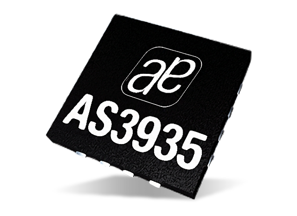
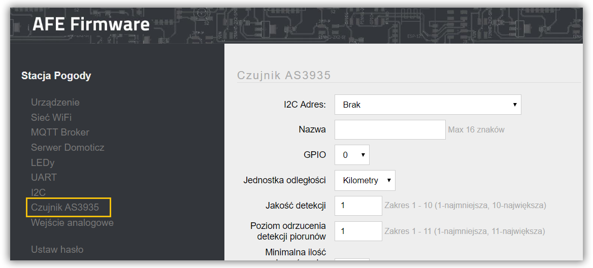

!!!! Obsługa czujnika dostępna jest w [wersji PRO AFE Firmware](/postawowe-informacje/wersja-pro).

**AS3935** to czujnik wykrywający pioruny oraz potrafiący oszacować odległość od czoła burzy w promieniu do 40 km. 

---


**Spis treści**

    
    
    {{ table_of_contents }}
    



---

#### Specyfikacja:
* Zasięg wykrywania burzy: promień do 40km
* Dokładnością do 1km
* Wbudowany algorytm odrzucający fałszywe zdarzenia
* Programowany poziom\odległość od którego mają być wysyłane alarmy
* Napięcie zasilania: 2.4 do 5.5V
* Port SPI lub I²C
* [Specyfikacja AS3935](Sensor%20AS3935.pdf)

---

!! AFE Firmware wymaga, aby czujnik podłączony został do magistrali [I²C](/konfiguracja/konfiguracja-urzadzenia/konfiguracja-portow/i2c/?target=_blank) konieczne jest podłączenie czujnika również do jednego z dostępnych GPIO. Jeśli zostanie wykryty piorun wysyłany jest impuls do GPIO,

---

Ekran do konfiguracji czujnka AS3935 otwiera się wybierając opcję Czujnik AS3935 -> Czujnik w menu Panelu Konfiguracyjnego AFE Firmware.

#### Sekcja: Czujnik AS3935

##### I²C Adres
* Adres czujnika w magistrali I²C

> Jeśli adres czujnika nie jest widoczny w liście sprawdź podłączenie czujnika lub konfigurację [I²C](/konfiguracja/konfiguracja-urzadzenia/konfiguracja-portow/i2c/?target=_blank)

##### Nazwa
* Nazwa czujnika
* Nazwa wykorzystywana jest do odczytu wartości z czujnika za pomocą HTTP
* Maksymalna długość nazwy to do 16 znaków
* Nie należy używać znaków spacji

##### GPIO
* Numer GPIO do którego podłączony jest czujnik
* Wartość jest wymagana

##### Jednostka odległości
* Jednostka odległości w czoła burzy
* Kilometry lub Mile

##### Jakość detekcji
* Im większa liczba tym jakość detekcji piorunów jest lepsza oraz zmniejsza się zasięg detekcji czoła burzy
* Wartość z zakresu 1 do 10

##### Poziom odrzucenia detekcji piorunów
* Im większa liczba tym dokładnieszy algorytm odrzucenia błędnych sygnałów detekcji piorunów. Im większa wartość tym mniejszy zasięg detekcji czoła burzy
* Wartość z zakresu 1 do 10

##### Minimalna ilośc piorunów, aby zaraportować detekcję bury
* Ilość piorunów zanim czujnik zgłosi wykrycie burzy

##### Inteligentna kontrola poziomu szumów
* Automatyczne dostosowanie poziomu szumów 

##### Poziom hałasu
* Ręczne ustawienie poziomu szumów
* Wartośc z zakresu: 1 do 7
* 1 mało szumów, 7 dużo szumów

##### Lokalizacja czujnika
* Ustawienie lokalizacji czujnika
* Wewnątrz lub na zewnątrz budynku

#### Sekcja: Domoticz

! Sekcja konfiguracyjna widoczna jest tylko, gdy włączone jest [Domoticz API](/konfiguracja/konfiguracja-urzadzenia/konfiguracja-urzadzenia)

##### IDX
* Wartość z zakresu 1 do 999999
* W przypadku wprowadzenia 0, wartość danego pomiaru, nie będzie wysyłana do Domoticz

#### Sekcja: Temat MQTT Czujnika AS3935

Aby było możliwe przysłanie wartości do systemu automatyki z wykorzytaniem MQTT API, konieczne jest ustawienie Tematu MQTT dla czujnika

! Sekcja konfiguracyjna widoczna jest tylko, gdy włączone jest [MQTT API](/konfiguracja/konfiguracja-urzadzenia/konfiguracja-urzadzenia)

#### Temat
* Temat wiadomości w formacie MQTT
* Maksymalnie 64 znaki
* Jeśli temat nie zostanie wprowadzony, informacje z czujnika nie będa wysyłane do Brokera MQTT

> Tutaj znajdziejsz: [Najlepsze praktyki dotyczące formatów tematów MQTT](/integracja-api/mqtt/tematy-mqtt-najlepsze-praktyki)