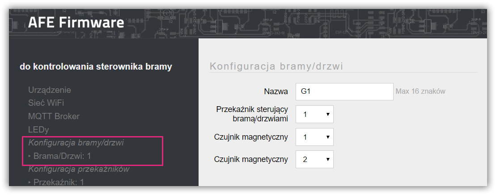

Funkcja sterowania bramą/drzwiami dostępna jest w [AFE Firmware T5](/postawowe-informacje/wersje-afe-firmware/t5-brama-drzwi).

Poniżej przedstwiony jest przykład konfiguracji bramy, która posiada dwa czujniki magnetyczne, które monitorują stan otwarcia/zamknięcia bramy.

---


**Spis treści**

    
    
    {{ table_of_contents }}
    



---

### Konfiguracja urządzenia

Po zainstalowaniu [AFE Firmware T5](/pliki-to-pobrania/afe-firmware) oraz [skonfigurowaniu połączenia do routera WiFi](/instalacja/instalacja-zanim-zainstalujesz-firmware/pierwsze-uruchomienie) uruchamiamy Panel Konfiguracyjny AFE Firmware. 

W formularzu konfiguracji Urządzenia wprowadzamy liczbę podłączonych elementów

> Aby sterować bramą urządzenie powinno posiadać przynajmniej jeden przekaźnik. Przekaźnik będzie podawał impuls na sterownik bramy, który będzie uruchamiał napęd bramy. Dobrze jest podłączyć do urządzenia kontaktron, czujnik magnetyczny lub krańcowy. Czujnik ten umożliwi uzyskanie informacji, czy brama jest otwarta lub zamknięta. 

Jeśli do kontrolowania stanu bramy podłączymy **jeden** czujnik magnetyczny to stan bramy będzie przyjmować jedną z trzech wartości:
* otwarta
* zamknięta

Jeśli do kontrolowania stanu bramy podłączymy **dwa** czujnik magnetyczne to stan bramy będzie przyjmować jedną z trzech wartości:
* otwarta
* częściowa otwarta
* zamknięta

### Konfiguracja czujnika magnetycznego

Po zapisaniu konfiguracji urządzenia, konfigurujemy czujnik magnetyczne, jeśli zostały podłączone do urządzenia.

##### GPIO

* Numer GPIO do którego podłączona jest czujnik magnetyczny
* Zakres od 0 do 16
* Wartość musi zostać wybrana

##### Nazwa

* Unikalna nazwa czujnika
* Nazwa wykorzystywana jest do odczytywania stanu czujnika magnetycznego
* Każdy czujnik w ramach urządzenia musi mieć unikalną nazwę
* Maksymalna długość nazwy to do 16 znaków
* Nie należy używać znaków spacji

##### Typ

* NO - Normalnie otwarty
* NC - Normalnie zamknięty

##### LED przypisany do czujnika

* Numer diody LED, która będzie sygnalizowała stan czujnika magnetycznego

##### Czułość (bouncing)

* Parametr określa czułość czujnika oraz umożliwia weliminowanie mikrodrgań styków czujnika
* Im niższa wartość tym czujnik magnetyczny jest bardziej czuły na zmiany
* Zakres od 0 do 2000 milisekund (2sek)

! Wartość parameteru należy zmienić wyłączenie jeśli podczas korzystania z czujnika magnetycznego występują nadmiarowe zmiany jego stanu. Ustawienie tej wartości należy dokonać metoda prób i błędów, aż do uzyskania pożądanego efektu

### Konfiguracja bramy

W kolejnym kroku konfigurujemy bramę. Wybieramy, 
* który przekaźnik podaje impuls do sterownika bramy,
* które czujniki magnetyczne kontrolują stan otwarcia/zamknięcia bramy oraz 
* ustawiamy stan bramy w zależności od stanu czujników magnetycznych.

#### Sekcja Konfiguracja bramy/drzwi

##### Nazwa

* Unikalna nazwa bramy
* Nazwa bramy wykorzystywana jest do odczytywania stanu otwarcia/zamknięcia bramy
* Każdy brama w ramach urządzenia musi mieć unikalną nazwę
* Maksymalna długość nazwy to do 16 znaków
* Nie należy używać znaków spacji

##### Przekaźnik 

* Numer przekaźnika sterującego bramą (przekaźnika, który wysyła impuls to sterownika bramy)

##### Czujnik magnetyczny

* Number czujnika magnetycznego, który informuje o stanie bramy

> Stan bramy mogą maksymalnie kontrolować dwa czujniki magnetyczne 

#### Sekcja: Konfiguracja stanów bramy

Formularz umożliwia ustawienie stanu bramy w zależności od stanów poszczegółnych czujników magnetycznych

> C1 oraz C2 na poniższym ekranie to nazwy czujników magnetycznych, które definiuje się w formularzu konfiguracji czujnika magnetycznego

> W zależności od ilości podłączonych do urządzenia czujników magnetycznych oraz przypisania ich do bramy formularz umożliwia konfigurację dwóch lub trzech stanów bramy: Otwarta, Zamknięta, Częściowa otwarta

### Konfiguracja przekaźnika

Ostatnim etapem konfiguracji jest konfiguracja przekaźnika przpisanego do bramy, który podaje impuls sterujący do sterownika bramy

##### GPIO
* Numer GPIO do którego podłączony jest przekaźnik
* Zakres od 0 do 16
* Wartość musi zostać wybrana

##### Długość impulsu

* Czas, na jak długo przekaźnik ma zostać załączony (długość impulsu)
* Wartość ustawiana jest w milisekundach od 1msek do 99999msek - co daje prawie ;-) 100sek