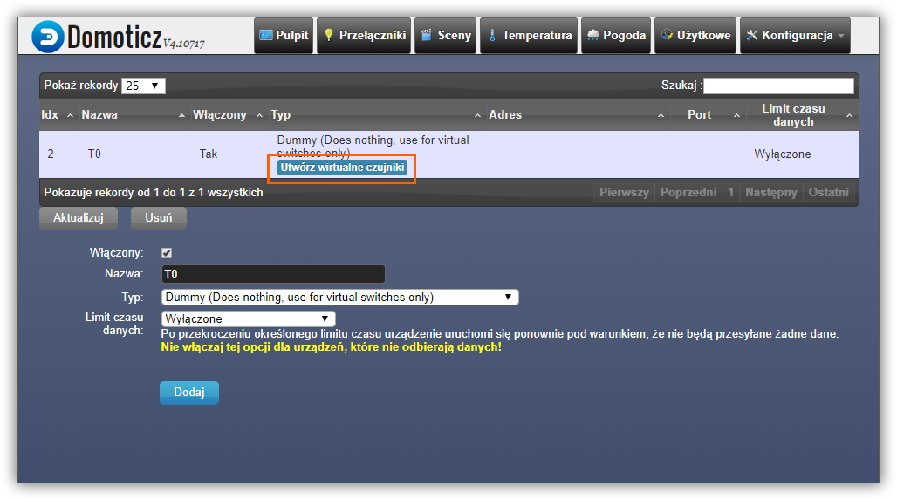
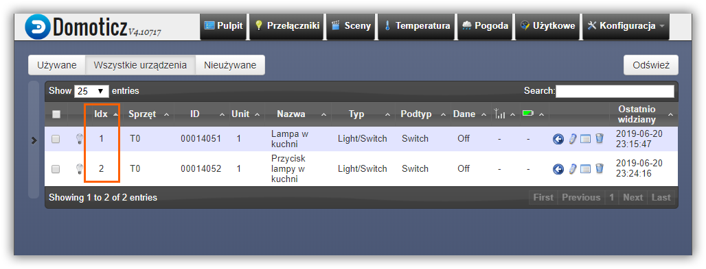
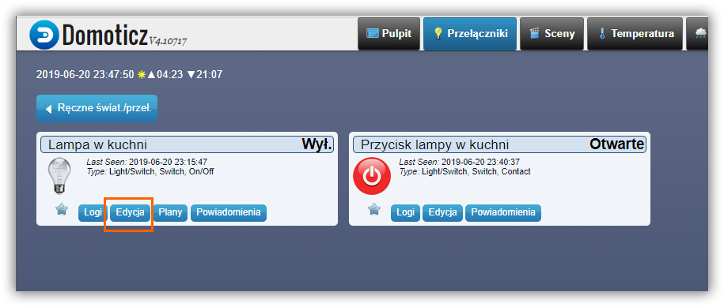
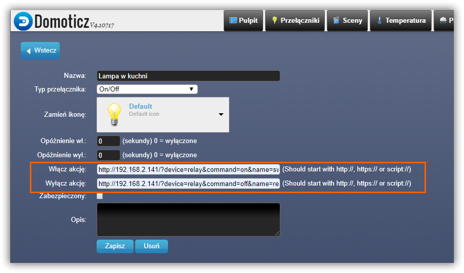

* Domoticz API umożliwia dwukierunkową integrację między urządzeniem z AFE Firmware, a Domoticz
* Integracja opiera się o protokół HTTP
* Do poprawnego działania Domoticz API, należy go włączyć w [konfiguracji urządzenia](/konfiguracja/konfiguracja-urzadzenia/konfiguracja-urzadzenia) oraz [skonfigurować połączenie do serwera](/konfiguracja/konfiguracja-urzadzenia/konfiguracja-mechanizmow-sterowania/serwer-domoticz) z zainstalowanym Domoticz.

##### Procedura konfiguracji wygląda następująco:
* w Domoticz dodajemy urządzenie typu Dummy, do którego dodajemy wirtualne elementy, jak włączniki, czy czujniki np.: temperatury
* każdy z takich wirtualnych elementów otrzymuje unikalny identyfikator IDX
* następnie w AFE Firmware 
	* konfigurujemy połączenie do serwera Domoticz oraz 
	* wprowadzamy identyfikatory IDX w odpowiednich ekranach konfiguracyjnych

#### Konfiguracja przekaźnika oraz przycisku/włącznika

* Wchodzimy do panelu sterującego Domoticz, a następnie do **Konfiguracja -> Sprzęt**. 
* Dodajemy wirtualne urządzenie. Jak na poniższym ekranie

* Po wciśnięciu przycisku **Dodaj** pokaże nam się urządzenie na liście.
* Wciskamy przycisk: **Utwórz wirtualny czujnik**

* Konfigurujemy wirtualny czujnik
* W przykładzien, nazywam go: **Lampa w kuchni**, bo będzie włączał / wyłączał lampę
* Wirtualny czujnik będzie miał typ: **przełącznik**

> W tym kroku tworzymy wirtualny przełączik do monitorowania wciśnięcia przycisku np. w ścianie do włączania / wyłączania lampy. W większości przypadków nie mam potrzeby monitorowania stanu przycisku, więc ten krok konfiguracji jest opcjonalny.

* Dodajemy kolejny wirtualny czujnik typu: **przełącznik**
* Nazywam go: **Przycisk lampy w kuchni**

* Oba wirtualne elementy widoczne są teraz na liście urządzeń
* Dla każdego z nich nadany został unikalny numer **IDX** - zapamiętujemy je

* Przechodzimy teraz na zakładkę **Przełączniki**, gdzie powinny znajdować się dodane elementy
* W kolejnym kroku zmienimy typ przełącznika, który został dodany do monitorowania stanu włącznika (np. w ścianie), na taki który lepiej obrazuje i zachowuje się w takim zastosowaniu
* Wciskamy przycisk **Edytuj**

* Ustawiamy typ przełącznik na: **Contact**
* Zmieniamy ikonę na np. taką, jak na poniższym przykładzie
* Zapisujemy zmiany

* W kolejnych krokach wprowadzimy komendy sterujące przekaźnikem
* Wciskamy przycisk **Edytuj** w elemencie sterującym naszą Lampą

* Wprowadzamy w polach: **Włącza akcję** i **Wyłącz akcje** następujące komendy w formacie

**włącz**: `http://ADRES-IP-URZADZENIA/?device=relay&source=domoticz&name=NAZWA-PRZEKAZNIKA&command=on`

**wyłącz**: `http://ADRES-IP-URZADZENIA/?device=relay&source=domoticz&name=NAZWA-PRZEKAZNIKA&command=off`

**Parametery**: 
* _ADRES-IP-URZADZENIA_ - to adres IP urządzenia z zainstlowanym AFE Firmware
* _NAZWA-PRZEKAZNIKA_, definiowany jest w AFE Firmware w [konfiguracji przekaźnika](/konfiguracja/konfiguracja-urzadzenia/konfiguracja-przekaznika)

! Z doświadczenia wiem, że wielu użytkowników AFE Firmware zapomina dodawać ten fragment **&source=domoticz** do komendy sterującej. Nie dodanie tego elementu, może spowodować, że Domoticz + Urządzenie z AFE Firmware wpadnie w pętlę włączania / wyłączania się

