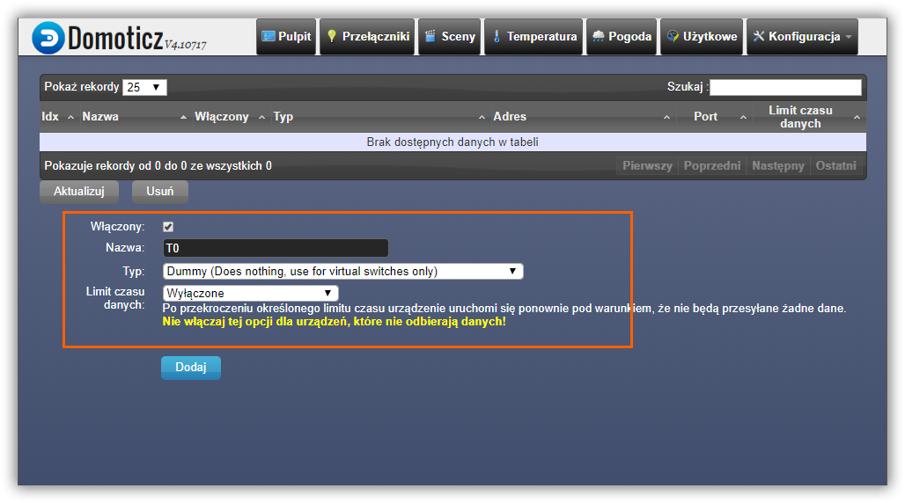
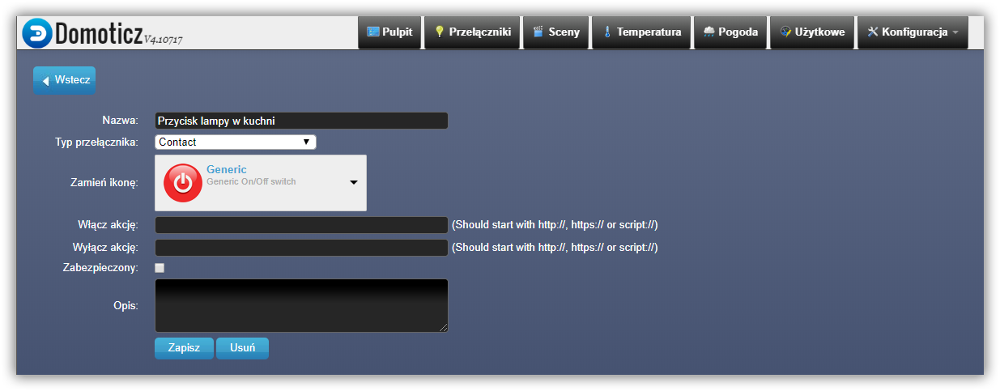

* Domoticz API umożliwia dwukierunkową integrację między urządzeniem z AFE Firmware, a Domoticz
* Integracja opiera się o protokół HTTP lub MQTT (od AFE wersji 2.1)
* Do poprawnego działania Domoticz API, należy go włączyć w [konfiguracji urządzenia](/konfiguracja/konfiguracja-urzadzenia/konfiguracja-urzadzenia) oraz 
	* w przypadku Domoticz HTTP API [skonfigurować połączenie do serwera Domoticz](/konfiguracja/konfiguracja-urzadzenia/konfiguracja-mechanizmow-sterowania/serwer-domoticz)
	* w przypadku Domoticz MQTT API [skonfigurować połączenie do brokera MQTT](/konfiguracja/konfiguracja-urzadzenia/konfiguracja-mechanizmow-sterowania/mqtt-broker) 

!! Bezproblemowe wsparcie Domoticz w wersji 2020 dostępne jest od AFE w wersji 2.2.x

##### Procedura konfiguracji wygląda następująco:
* w Domoticz dodajemy urządzenie typu Dummy, do którego dodajemy wirtualne elementy, jak włączniki, czy czujniki np.: temperatury
* każdy z takich wirtualnych elementów otrzymuje unikalny identyfikator IDX
* następnie w AFE Firmware 
	* konfigurujemy połączenie do serwera Domoticz oraz 
	* wprowadzamy identyfikatory IDX w odpowiednich ekranach konfiguracyjnych

#### Konfiguracja przekaźnika oraz przycisku/włącznika

* Wchodzimy do panelu sterującego Domoticz, a następnie do **Konfiguracja -> Sprzęt**. 
* Dodajemy wirtualne urządzenie. Jak na poniższym ekranie

* Po wciśnięciu przycisku **Dodaj** pokaże nam się urządzenie na liście.
* Wciskamy przycisk: **Utwórz wirtualny czujnik**

* Konfigurujemy wirtualny czujnik
* W przykładzien, nazywam go: **Lampa w kuchni**, bo będzie włączał / wyłączał lampę
* Wirtualny czujnik będzie miał typ: **przełącznik**

> W tym kroku tworzymy wirtualny przełączik do monitorowania wciśnięcia przycisku np. w ścianie do włączania / wyłączania lampy. W większości przypadków nie mam potrzeby monitorowania stanu przycisku, więc ten krok konfiguracji jest opcjonalny.

* Dodajemy kolejny wirtualny czujnik typu: **przełącznik**
* Nazywam go: **Przycisk lampy w kuchni**

* Oba wirtualne elementy widoczne są teraz na liście urządzeń
* Dla każdego z nich nadany został unikalny numer **IDX** - zapamiętujemy je

* Przechodzimy teraz na zakładkę **Przełączniki**, gdzie powinny znajdować się dodane elementy
* W kolejnym kroku zmienimy typ przełącznika, który został dodany do monitorowania stanu włącznika (np. w ścianie), na taki który lepiej obrazuje i zachowuje się w takim zastosowaniu
* Wciskamy przycisk **Edytuj**

* Ustawiamy typ przełącznik na: **Contact**
* Zmieniamy ikonę na np. taką, jak na poniższym przykładzie
* Zapisujemy zmiany

! W przypadku zastosowania Domoticz HTTP API w kolejnym kroku konieczne jest [ustawienie komend sterujących przekaźnikiem](/integracja-api/domoticz-api/komendy-sterujace-http-api/?target=_blank).

!! **Uwaga**. W przypadku zastosowania Domoticz MQTT API komendy sterującę (Włącz / Wyłacz akcja) nie mogą być wprowadzone. Domoticz automatycznie wysyła komendy do AFE Firmware za pośrednictwem MQTT Brokera. Należy na to zwrócić szczególną uwagę w przypadku aktualizacji AFE Firmware ze starszych wersji. Pozostawienie komend włącz/wyłącz może spowodować, że Domoticz i urządzenie z AFE Firmware wpadną w pętlę włączania / wyłączania przekaźnika

* W tym momencie zakończona została konfiguracja w Domoticz
* W kolejnych krokach wpisane zostaną identyfikatory IDX w konfiguracji AFE Firmware
* Otwieramy Panel Konfiguracyjny AFE Firmware
* Otwieramy [formularz konfiguracyjny przekaźnika](/konfiguracja/konfiguracja-urzadzenia/konfiguracja-przekaznika), a następnie w polu IDX wprowadzamy identyfikator zapamiętany w poprzednich krokach

* Podobną czynność przeprowadzamy dla przycisku/włącznika, jeśli takowy dodaliśmy
* Otwieramy [formularz konfiguracji przycisku/włącznika](/konfiguracja/konfiguracja-urzadzenia/konfiguracja-przycisku-wlacznika), a następnie w polu IDX wprowadzamy identyfikator zapamiętany w poprzednich krokach

---

W tym momencie jeśli wszystko dobrze poszło, Domoticz i urządzenie z AFE Firmware powinny ze sobą współpracować.

! Chcęc zwrócić uwagę, że Domoticz odświeża dane w przeglądarce w interwałach ok 8-9 sekundowych. Jeśli przekaźnik w urządzeniu z AFE Firmware zostanie przełączony ręcznie, to status w Domoticz, będzie odświeżony z maksymalnie 8-9 sekundowym opóźnieniem.

