OpenHab’a (OH2) można skonfigurować na kilka różnych sposobów, aby funkcjonował z urządzeniami z AFE Firmware.

Opisuję tutaj sposób z wykorzystaniem lekkiego protokołu wymiany widomości opartego o MQTT. Wg mnie jest to jeden z najlepszych mechanizmów integracji urządzeń w ramach automatyki.

* Poniższa instrukcja wykorzystuje MQTT Binding w wersji 2.x
* Konfigurowany będzie przekaźnik, analogicznie można dodawać inne elementy

> [Konfiguracja](https://www.smartnydom.pl/afe-firmware-pl/konfiguracja/openhab/) openHAB w starej wersji MQTT Binding 1.4

---


**Spis treści**
<div class="page-toc">
    
    
    {{ table_of_contents }}
    
</div>


---

#### Wymagania
* Zainstalowany dodatek OH2: MQTT binding 2.x w openHAB
* Zainstalowany MQTT Broker np. Mosquitto

! **Informacja**: Od wersji 2.4 dostępny jest dodatek: Embaded MQTT Broker.  Teoretycznie można go wykorzystać zamiast Mosquitto. Natomiast praktycznie są z nim problemy dlatego na dzień dzisiejszy nie będę go wykorzystywał w tej instrukcji.

* Zainstalowany dodatek OH2: **JSONPath Transformation**
* Urządzenie z zainstalowanym [AFE Firmware](l/postawowe-informacje/o-afe-firmware)

#### Kroki instalacji oraz konfiguracji
* Instalacja wymaganych dodatków w OpenHAB
* Instalacja MQTT Brokera
* Instalacja AFE Firmware
* Konfiguracja AFE Firmware
* Konfiguracja openHAB za pomocą Paper UI
	* Konfiguracja połączenia do MQTT Brokera
	* Dodawanie nowego Thing (rzecz, urządzenie)
	* Dodawanie nowych Items (elementów urządzenia)
	* Zbudowanie sitemap’y do wyświetlania elementów
* Konfiguracja openHAB bez pomocy Paper UI (zaawansowane, ale szybsze)

#### Instalacja wymaganych dodatków w OpenHAB

> Wszystkie dodatek będą instalowane za pomocą interface PaperUI dostępnego w openHAB.

* Otwieramy openHAB Paper UI:

`http://IP-OPENHAB:PORT-OPENHAB/paperui/`
 
np.:

`http://192.168.2.146:8080/paperui/`


##### Instalacja MQTT Binding 2.x

##### Instalacja JSONPath Transformation

#### Instalacja MQTT Brokera

_Do napisania. Tymczasem poszukaj w internecie_

#### Instalacja AFE Firmware

Postępuj wg tej [instrukcji](l/instalacja/instalacja-zanim-zainstalujesz-firmware)

#### Konfiguracja AFE Firmware
##### Włączamy MQTT API

* Uruchamiamy w urządzeniu Panel Konfiguracyjny
* Włączamy **MQTT API**

* Zapisujemy zmiany

##### Konfigurujemy połączenie do MQTT Brokera
* w konfiguracji wpisujemy albo nazwę hosta bądź adres IP, na którym zainstalowany jest MQTT Broker. Najczęściej będzie to ten sam host/adres IP, na którym zainstalowany jest openHAB
* Jeśli nie ma autoryzacji do MQTT Brokera – nazwę użytkownika oraz hasło zostawiamy puste.

* Więcej na temat konfiguracji MQTT Brokera przeczytasz [tutaj](/konfiguracja/konfiguracja-urzadzenia/konfiguracja-mechanizmow-sterowania/mqtt-broker)

##### Konfigurujemy temat sterujący przekaźnikiem
* Uruchamiamy formularz konfiguracyjny Przekaźnika
* W tym miejscu konfigurujemy temat wiadomości MQTT sterujący przekaźnikiem
* Więcej na temat konfiguracji przekaźnika przeczytasz [tutaj](/konfiguracja/konfiguracja-urzadzenia/konfiguracja-przekaznika)


> Na ekranie wpisałem temat wiadomość **t0/relay** i taki będę używał w dalszej części tej instrukcji

**Ważne**:
* Zalecam ustalić sobie jakiś spójne nazewnictwo i używać dla wszystkich urządzeń np:
	* sonoff
	* salon/lampa
	* kuchnia/termometr
* Temat musi być unikalny w ramach wszystkich urządzeń, które korzystają z MQTT Brokera – czyli w ramach naszego domu może występować tylko jedno urządzenie z takim tematem MQTT

> Przeczytaj [dobre praktyki nazewnictwa tematów MQTT](/integracja-api/mqtt/tematy-mqtt-najlepsze-praktyki)

* Zapisujemy zmiany
* Wychodzimy z konfiguracju AFE Firmware wciskając link **Zakończ konfigurację**

#### Konfiguracja openHAB za pomocą Paper UI
Jak napisałem we wstępie openHAB można konfigurować na wiele różnych sposobów. Poniższy sposób wykorzystuje interfejs Paper UI. Można konfigurację wykonać ręcznie w plikach konfiguracyjnych. Konfigurowanie w plikach konfiguracyjnych jest szybsze, ale trzeba już trochę poznać openHAB i wiedzieć jak diagnozować błędy, które możemy zrobić podczas ręcznej konfiguracji. Konfiguracja ręczna jest opisana w dalszej części tego tutorial’a

##### Konfiguracja połączenia do MQTT Brokera
Teraz konfigurujemy połączenie do zainstalowanego MQTT Brokera. OpenHAB będzie nasłuchiwał wiadomości przychodzące do MQTT Brokera oraz będzie do niego wysyłał wiadomości, które będą sterowały naszymi urządzeniami

* Uruchamiamy ponownie openHAB PaperUI
* Wchodzimy do Inbox i wciskamy **(+)**
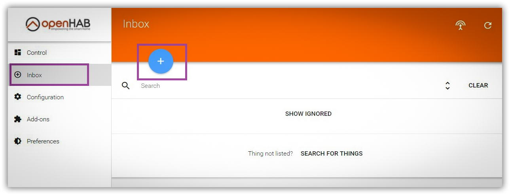
* Wybieramy** MQTT Binding**
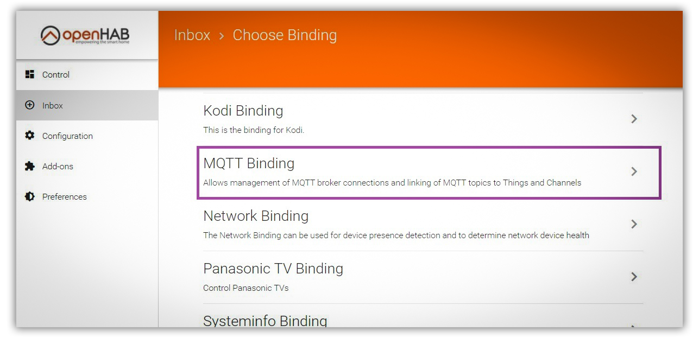
* Wciskamy **Add Manually**
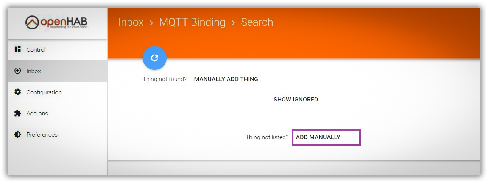
* Wprowadzamy nazwę oraz ID dla naszego MQTT Brokera w ramach openHab
	* Name: **Moj MQTT Broker**
	* Thing ID (musi być unikalne, bez spacji): **MojMQTTBroker**
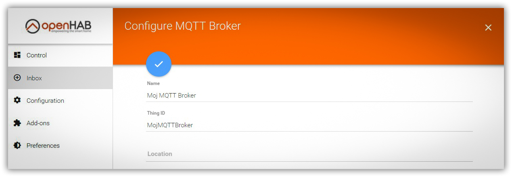
* Wprowadzamy **Host** lub **adres IP** oraz **Port** do naszego MQTT Broker.
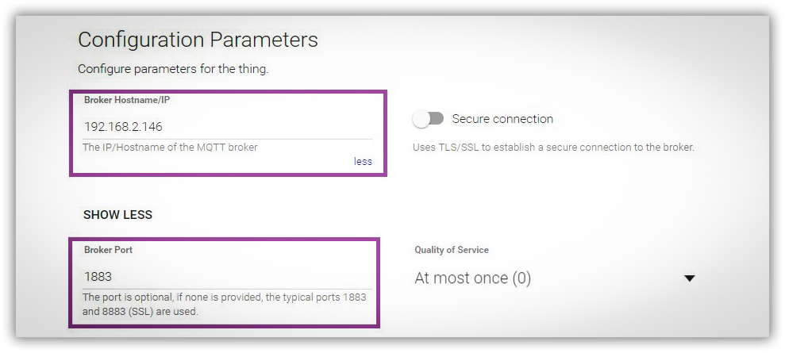
* Wpisujemy **Client IT** – nie jest to konieczne, ale ułatwia później śledzenie potencjalnych problemów w log’ach naszego MQTT Brokera
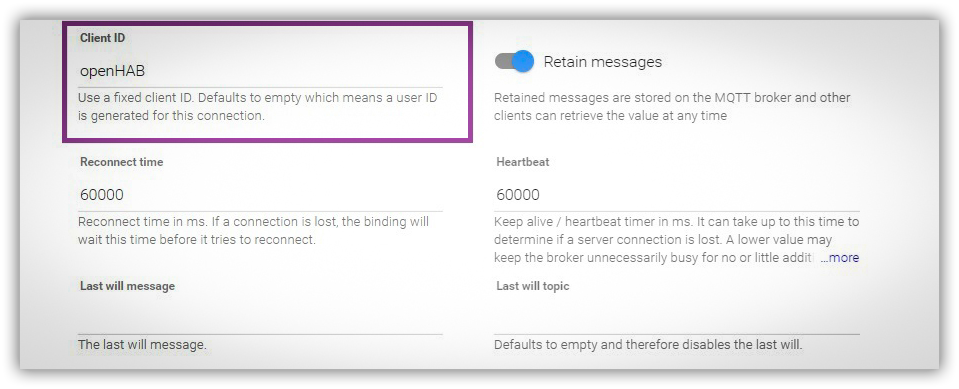
* Wprowadzamy **nazwę** i **hasło** do MQTT Brokera (jeśli używamy)

* Zapisujemy wciskając tę niebieską kulkę z „ptaszkiem” u góry powyższego ekranu
* Powinniśmy teraz odszukać nasz MQTT Broker na liście **Things** „Rzeczy” – jeśli jest OnLine – to wszystko poszło OK – jesteśmy podłączeni z openHAB do MQTT Brokera
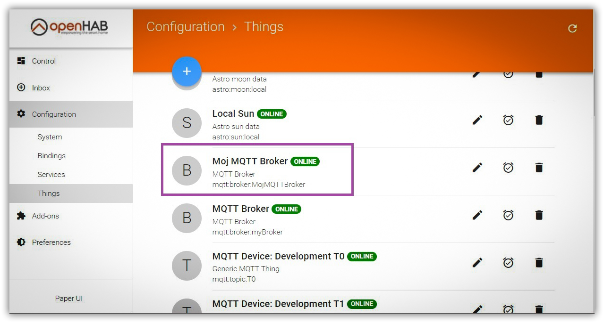

##### Dodawanie nowego Thing (rzecz, urządzenie)
Teraz dodamy nasze urządzenie, jako Thing do do OpenHAB

* Wchodzimy ponownie do Inbox i wciskamy **(+)**
* Wybieramy **MQTT Binding**
* Wciskamy **Add Manually**
* Tym razem wybieramy **Generic MQTT Thing**

* Wpisujemy nazwę oraz ID naszego urządzenia
	* Name: **Moje Urządzenie**
	* Thing ID (musi być unikalne, bez spacji): **MojeUrzadzenie**
* Wybieramy **Bridge Selection**: na liście powinien znajdować się nasze połączenie do MQTT Brokera o nazwie: **Moj MQTT Broker**

* Teraz nasze urządzenie powinno pokazać się na liście urządzeń z nazwą **Moje Urządzenie**
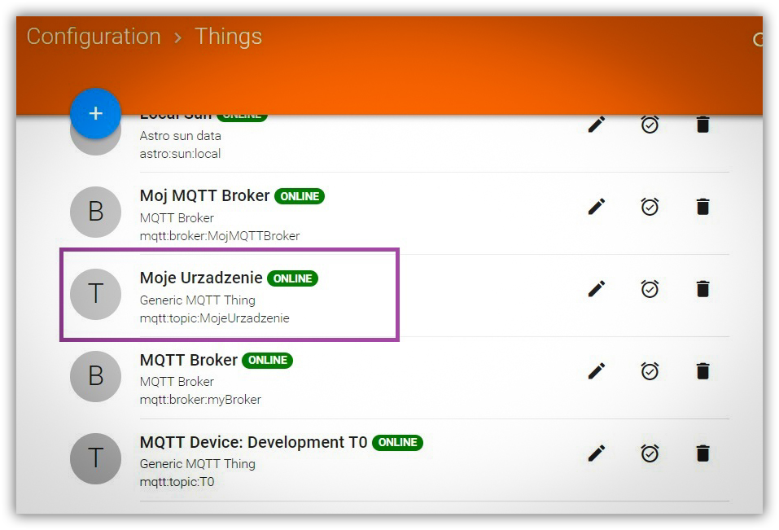
* Klikamy w nazwę **Moje urządzenie**. Wyświetli nam się to okno
* Będziemy teraz dodawać elementy fizyczne w ramach urządzenia. Mogą to być przekaźniki, czujnik temperatury, wilgotności itp.. Mogą to również elementy wirtualne, jak np. wirtualny włącznik, który uruchamia panel konfiguracyjny urządzenia z AFE Firmware
* Dodamy przekaźnik. Wciskamy **(+)** przy Channels
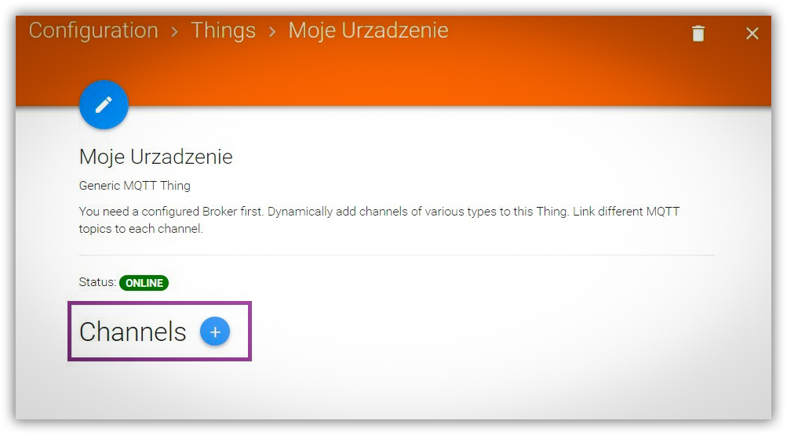
* Wybieramy Channel Typ: **On/Off switch**
* Wprowadzamy unikalny ID w ramach Thing (unikalne w ramach Thing, bez spacji): **Przekaznik**
* Nadajemy label’kę: **Przekaźnik**

* Wprowadzamy
	* MQTT State topic: **t0/relay/state**
		* Jest to temat MQTT pod który AFE Firmware wysyła w jakim stanie jest przełącznik: włączony / wyłączony
		* t0/relay – zdefiniowaliśmy w AFE Firmware w konfiguracji przekaźnika
		* /state – trzeba wpisać, wymagane przez AFE Firmware
	* MQTT Command topic: **t0/relay/cmd**
		* Jest to komenda wysyłana przez openHAB do AFE Firmware, która steruje przekaźnikiem
		* t0/relay – zdefiniowaliśmy w AFE Firmware w konfiguracji przekaźnika
		* /cmd – trzeba wpisać, wymagane przez AFE Firmware


* wprowadzamy wartości
	* On/Open: **on**
	* Off/Closed: **off**


* Wciskamy **Save**
* Takie coś powinno nam się ukazać po zapisaniu.
* W żółtej ramce jest zaznaczony tekst, który wykorzystam podczas dodawania Items
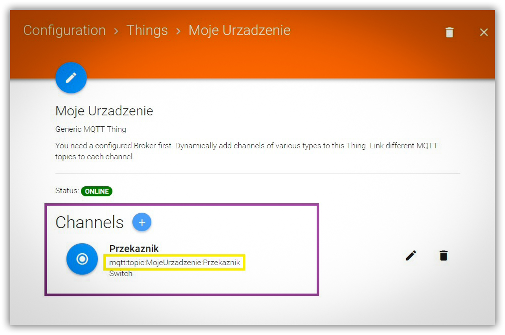

* Możemy sprawdzić, czy da się sterować urządzeniem
* Wchodzimy w **Control, Others** i wyszukujemy box’ik z nazwą **Moje Urządzenie**
* Przełącznikiem powinniśmy móc sterować przekaźnikiem
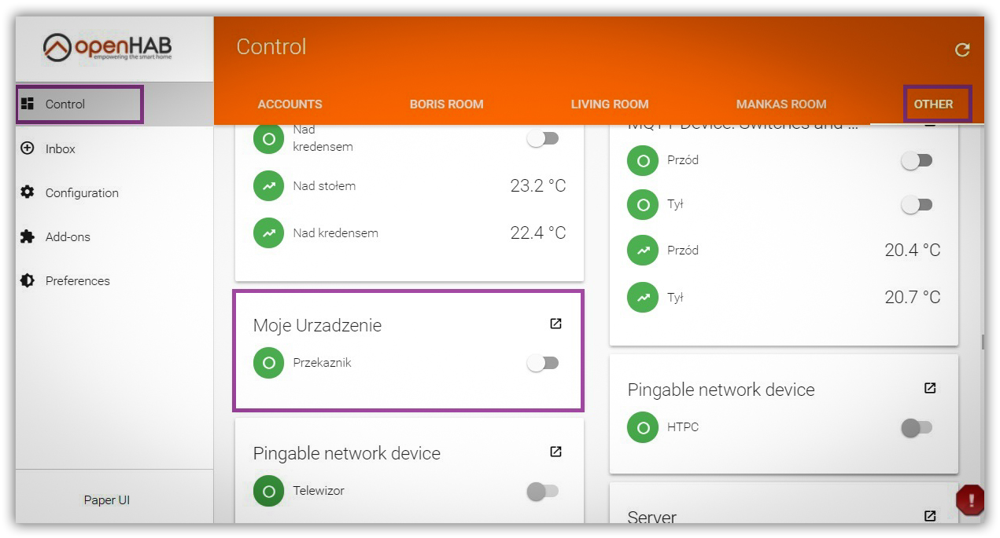
* Aby dodać inne elementy urządzenia (w zależności od funkcjonalności AFE Firmware) postępuj analogicznie powtarzając ten punkt instrukcji.
* [Tutaj](/integracja-api/mqtt) są wszystkie komendy MQTT do wykorzystania w dodatkowych Channels lub skorzystaj z gotowej tej [listy parameterów dla Channels](https://www.smartnydom.pl/afe-firmware-pl/konfiguracja/openhab-nowy-mqtt/channels/)

##### Dodawanie nowych Items (elementów urządzenia)
* Aby móc sterować urządzeniem z aplikacji mobilnej openHAB lub innej lub za pomocą interfejsu ClassicUI, BasicUI, HabPanel itp. konieczene jest dodanie elementów (items)
* W PaperUI nie można dodawać items. Robi się to ręcznie w plikach konfiguracyjnych lub można skorzystać z HomeBuilder w ramach openHAB, który wspomaga robienie Items oraz Sitemap’ę
* Ja pokażę jak to robić ręcznie bez wykorzystania HomeBuilder’a
* Items dodajemy w plikach, które znajdują się w katalogu konfiguracyjnym

`/etc/openhab2/items/`
 
> **Sugestia**: sugeruje różnego typu elementy (items) tworzyć w osobnych plikach. Z czasem nasz system do automatyki rozbuduje się i trzymanie wszystkiego w jednym pliku będzie uciążliwe do zarządzania.

* Przykładowa struktura moich plików z items
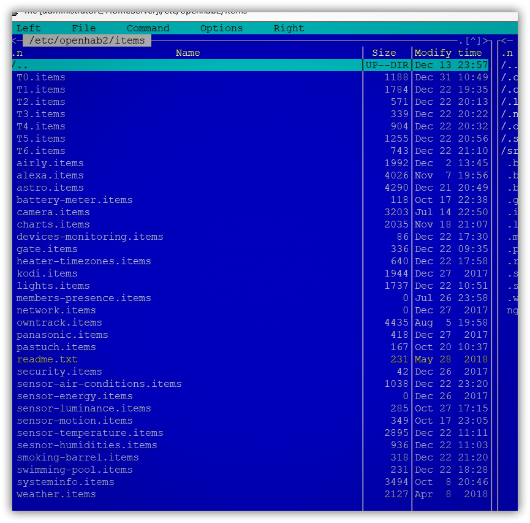

* Na potrzeby tego tutorial tworze nowy plik w tym katalogu o nazwie: przelaczniki.items
 
!! **Uwaga**: po utworzeniu nowego pliku sprawdź, czy właścicielem pliku jest użytkownik: openhab oraz grupa: openhab

Do pliku dodajemy nasz Item

`Switch moj_pierwszy_switch "Przełącznik" {channel="mqtt:topic:MojeUrzadzenie:Przekaznik"}`
 
**Legenda**:

* **Switch** – typ Item
* **moj_pierwszy_switch** – unikalna nazwa item
* **"Przełącznik"** – labelka wyświetlania
* **{channel="mqtt:topic:MojeUrzadzenie:Przekaznik"}** – połączenie Item z Thing
* 
Skąd wziąłem: **mqtt:topic:MojeUrzadzenie:Przekaznik** – żółta ramka, o której wspomniałem wcześniej

* Zapisujemy zamiany w pliku

##### Zbudowanie sitemap’y do wyświetlania elementów
* Sitemap’ę można zbudować za pomoca HomeBuilde’ra lub oczywiście ręcznie 🙂 w plikach konfiguracyjnych
* Sitemap’y znajdują się w katalogu konfiguracyjnym:

`/etc/openhab2/sitemaps`
 
* To co musimy zrobić to umieścić w naszej sitemap’ie zdefiniowany w poprzednim punkcie Item
* Do SiteMapy trzeba wprowadzić następujący element

`Switch item=moj_pierwszy_switch`
 
* **Switch** – typ elementu, który mam nam się wyświetlić
* **item=moj_pierwszy_switch** – wiąże typ elementu Switch z naszym Item. Jak widać po znaku = wpisuje nazwę Item, który zdefioniowałem w poprzednim kroku

! Uwaga: jeśli w katalogu konfiguracyjnym nie mamy, żadnej sitemap’y trzeba utworzyć nową sitemap’ę np. MojDom.sitemap

```
sitemap MojDom label="Mój Dom" {

    /* Tutaj są elementy naszej sitemapy */
    Switch item=moj_pierwszy_switch
}
```

* Zapisujemy zmiany
* Od teraz powinniśmy móc sterować naszym przełącznikiem za pomocą aplikacji mobilnej openHAB lub innych interfejsów, jak ClassicUI, BasicUI, HABPanel itp
* Jeśli mamy zainstalowany w openHAB BasicUI to otwarcie poniższego URL powinno uruchomić utworzoną w poprzednim kroku SiteMap’ę **MojDom.sitemap**

 
`http://IP-OPEN-HAB:8080/basicui/app?sitemap=MojDom`
 
